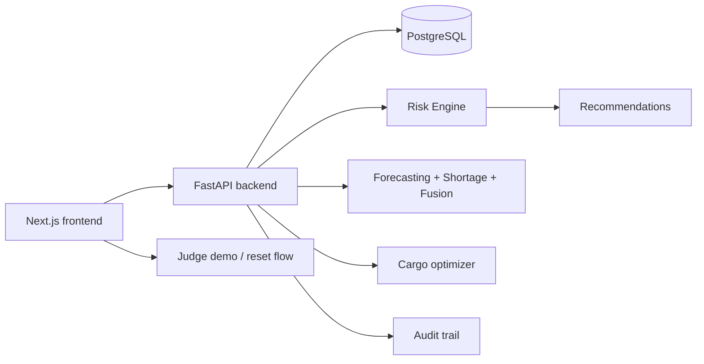

# POLARIS Architecture

## Overview
POLARIS is a synthetic, explainable expedition intelligence platform designed for polar logistics operations. It combines deterministic data models, operational forecasting, shortage prediction, cargo optimization, dependency-aware risk analysis, and human approval workflows.

## High-level structure

## Frontend
- Next.js app router pages for operations, risk, cargo, assets, missions, transport, emergency operations, and demo flows
- Client-side fetches against the FastAPI API
- Demo-mode and mission-control visuals are intentionally deterministic and explainable

## Backend
- FastAPI service exposing operational and decision-support APIs
- SQLAlchemy models for expeditions, cargo, inventory, transport, missions, assets, risks, recommendations, and audits
- Startup seeding and schema stabilization keep the demo environment reproducible

## Database
- PostgreSQL database with seeded synthetic expedition data
- Relationships connect stations, expeditions, transport flows, cargo, inventory, assets, and missions
- The schema preserves the critical T04 -> C018 -> GF14 -> G07 -> M12 dependency chain

## POLARIS AI layer
- Demand forecasting estimates future consumption based on recent history
- Shortage prediction estimates days of supply and risk severity
- Risk fusion combines factors from inventory, transport, asset, mission, and environment inputs
- Cargo optimization uses OR-Tools CP-SAT to prioritize mission-critical loads under capacity constraints

## Recommendation engine
- Risk events generate human-reviewable recommendations
- A recommendation can be approved, rejected, or modified
- Each decision creates an audit record for traceability

## Map and emergency center
- Mission control consolidates operational KPIs and alert status
- Emergency center and map views explain operational impact through a single dependency path
- The system never invents facts; it reports on the current database state and risk model outputs

## Operational limitation
This is a prototype using synthetic demonstration data, not official NCPOR operational thresholds.
